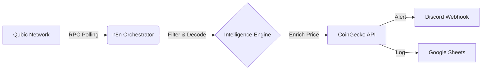

# Qubic Sentinel 🛡️

**The Watchtower of the Qubic Ecosystem.**

> *Bringing transparency to the dark forest of blockchain data.*

## 📖 Overview

The Qubic network is high-performance and tick-based, but its data can be opaque to the average user. "Whales" move billions of units in silence, and market-moving events often go unnoticed until it's too late.

**Qubic Sentinel** solves this by providing a real-time intelligence layer. It listens to the network pulse, filters for high-value events, and delivers actionable alerts directly to the community.

## 🚀 Key Features

*   **🐋 Whale Detection**: Instantly flags transactions exceeding **1 Billion QUBIC**.
*   **⚡ QX DEX Monitoring**: Decodes smart contract interactions to track buy/sell activity on the Qubic Exchange.
*   **💰 Real-Time Enrichment**: Automatically calculates USD value using live CoinGecko price feeds.
*   **🛡️ Risk Scoring**: Assigns dynamic risk scores (Low/Medium/High) based on volume and destination.
*   **📊 Data Archival**: Logs every significant event to Google Sheets for long-term historical analysis.

## 🏗️ Architecture

Qubic Sentinel is built on a **100% Free Tech Stack**, demonstrating the power of the "EasyConnect" ethos—accessible, powerful, and no-code friendly.

*   **Ingestion**: Polls Qubic RPC nodes for tick data.
*   **Processing**: n8n workflow executes JavaScript logic to filter noise and decode contract inputs.
*   **Output**: Delivers rich-text embeds to Discord and structured rows to Google Sheets.

## 🛠️ Getting Started

Want to run your own Sentinel? It's open-source and free.

### Prerequisites
*   **n8n** (Cloud Free Tier or Docker)
*   **Discord Server** (for Webhooks)
*   **Google Account** (for Sheets)

### Quick Setup
1.  **Database**: Create a Google Sheet with headers: `timestamp`, `tx_hash`, `source_id`, `dest_id`, `amount_qu`, `amount_usd`, `type`, `risk_score`.
2.  **Alerts**: Create a Discord Webhook in your server settings.
3.  **Deploy**: Import `workflows/n8n_workflow_sentinel.json` into n8n, connect your accounts, and activate!

## 📄 License

MIT License. Built for the Qubic Community.
