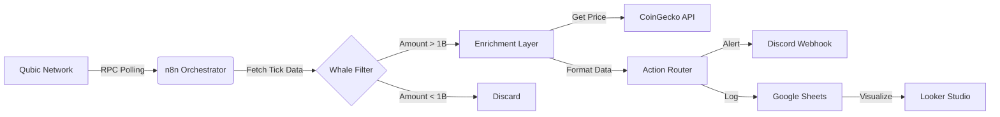

# Qubic Sentinel Architecture

## System Overview

Qubic Sentinel is an event-driven intelligence system designed to monitor the Qubic blockchain for high-value transactions ("Whales") and specific smart contract interactions (QX DEX). It uses a low-code/no-code approach to ensure accessibility and rapid deployment.

## Architecture Diagram

## Component Breakdown

### 1. Data Ingestion (n8n)
- **Source**: `https://rpc.qubic.org`
- **Method**: Polling every 60 seconds (Configurable).
- **Logic**:
  - Fetches `v1/status` to get the latest tick.
  - Fetches `v1/tick-transactions/{tick}` to get raw data.

### 2. Intelligence Layer (JavaScript)
- **Whale Filter**:
  - Iterates through all transactions in a tick.
  - Filters for `amount >= 1,000,000,000` (1 Billion QUBIC).
  - Identifies QX Contract interactions by checking `destId` against the QX address.
- **Enrichment**:
  - Fetches real-time QUBIC/USD price from CoinGecko.
  - Calculates USD value of the transfer.
  - Assigns a "Risk Score" based on volume and destination.

### 3. Storage & Visualization
- **Google Sheets**: Acts as the persistent database.
  - Columns: Timestamp, TxHash, Source, Dest, Amount (QU), Amount (USD), Type, Risk.
- **Looker Studio**: Connects to the Sheet to provide real-time dashboards.

### 4. Alerting
- **Discord**: Sends a rich embed message via Webhook.
  - Color-coded based on transaction type (Blue for Transfer, Gold for QX, Red for Risk).

## Security & Privacy
- **Read-Only**: The system does not require a wallet or private keys.
- **Data Privacy**: Addresses are masked in Discord alerts (e.g., `BAAA...RMID`) but stored fully in Sheets for analysis.
